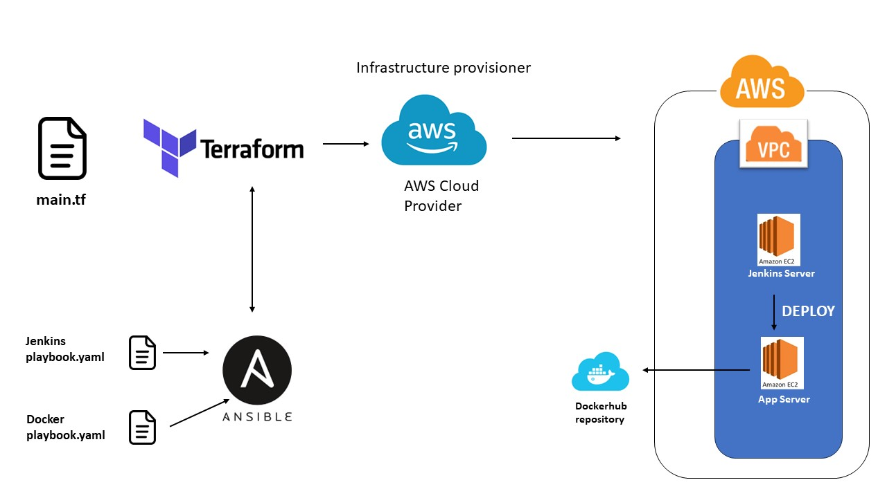

# DevOps_project
This repository is mainly used for DevOps projects

## 1. AWS instance

### 1.1 Terraform
- in order to run this project firstly you need to install terraform from the fallowing:  
https://developer.hashicorp.com/terraform/tutorials/aws-get-started/install-cli

#### 1.2 Description of main.tf
This terraform file contains several AWS resoursec needed in order to raise 2 AWS EC2 instances.  
    - resource "aws_instance" "app_server": instance used to raise and AWS EC2 instance needed to deploy the Wheather-app  
    - resource "aws_instance" "jenkins_server": instance used to raise and AWS EC2 instance needed to install Jenkinsm, where we wil run and build  the Wheather-app  

